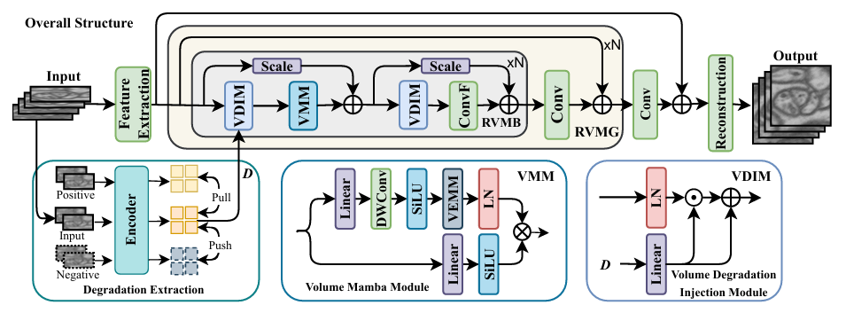
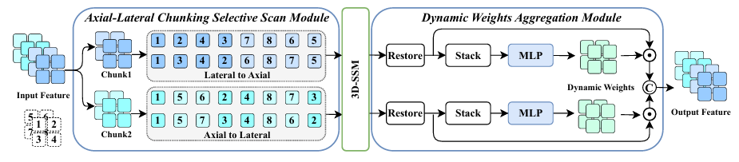

<div align="center">

# VEMamba: Efficient Isotropic Reconstruction of Volume Electron Microscopy with Axial-Lateral Consistent Mamba

[](https://arxiv.org/abs/2603.00887)
[](https://github.com/I2-Multimedia-Lab/VEMamba)
[](#)



*Overall architecture of VEMamba.*
</div>

---

## 🔥 News

* **[2026.03]** 🎉 Our paper has been accepted to **CVPR 2026**!
* **[2026.03]** 📄 Paper released on [arXiv](https://arxiv.org/abs/2603.00887).
* **[2026.03]** 💻 Code is now publicly available.

---

## 🧠 Method Overview

<div align="center">


*The Detail of the VEMamba Module.*
</div>

The VEMamba pipeline consists of four key stages:
1. **Shallow Feature Extraction**
2. **Degradation Representation Extraction** (via MoCo)
3. **Deep Feature Extraction** (using Residual Volume Mamba Groups)
4. **Reconstruction Module**

The core component is the **VEMamba Module (VEMM)**, which features:
* **ALCSSM:** Multi-directional 3D dependency scanning.
* **SSM:** Global dependency modeling.
* **DWAM:** Dynamic feature aggregation.

---

## 📂 Datasets

We evaluate our method on two public Volume Electron Microscopy (VEM) datasets:

### 1. [EPFL Dataset](https://www.epfl.ch/labs/cvlab/data/data-em/)
* **Content:** FIB-SEM hippocampus dataset with annotated mitochondria segmentation labels.
* **Resolution:** 5 × 5 × 5 nm

### 2. [CREMI Dataset](https://cremi.org/data/)
* **Content:** ssTEM dataset of *Drosophila melanogaster* brain (contains three training volumes: A, B, C).
* **Resolution:** 4 × 4 × 40 nm

---

## ⚙️ Environment

**Recommended Requirements:**
* `python == 3.10`
* `torch == 2.4.0`
* `causal_conv1d == 1.5.2`
* `mamba_ssm == 2.2.5`

**Standard Installation:**
```bash
pip install -r requirements.txt

```

> ⚠️ **Note:** To avoid environment conflicts, we highly recommend installing the following core packages manually from their official releases:
> * [causal-conv1d releases](https://github.com/Dao-AILab/causal-conv1d/releases)
> * [mamba releases](https://github.com/state-spaces/mamba/releases)


---

## 🚀 Training

Training is divided into two stages to ensure optimal representation learning and reconstruction.

### Stage 1: Degradation Learning (MoCo)

Train the MoCo encoder to effectively learn degradation representations.

```bash
python train_moco.py

```

### Stage 2: Reconstruction Training

Freeze the MoCo encoder and train the main reconstruction backbone.

```bash
python train.py

```

---

## 🧪 Testing

To reconstruct the full isotropic volume, run the following command. The output will be saved in your specified output directory.

```bash
python test.py

```

---

## 🙏 Acknowledgements

This project is built upon the excellent work from the following open-source repositories. We sincerely thank the authors for making their code publicly available:

* [SCST](https://github.com/ssj9596/SCST)
* [IsoVEM](https://github.com/cbmi-group/IsoVEM)
* [MambaIR](https://github.com/csguoh/MambaIR)
* [CDFormer](https://github.com/I2-Multimedia-Lab/CDFormer)

---

## 📚 Citation

If you find this work or code useful for your research, please cite our CVPR 2026 paper:

```bibtex
@inproceedings{gao2026vemamba,
  title={VEMamba: Efficient Isotropic Reconstruction of Volume Electron Microscopy with Axial-Lateral Consistent Mamba},
  author={Longmi, Gao and Pan, Gao},
  booktitle={Proceedings of the IEEE/CVF Conference on Computer Vision and Pattern Recognition (CVPR)},
  year={2026}
}

```

